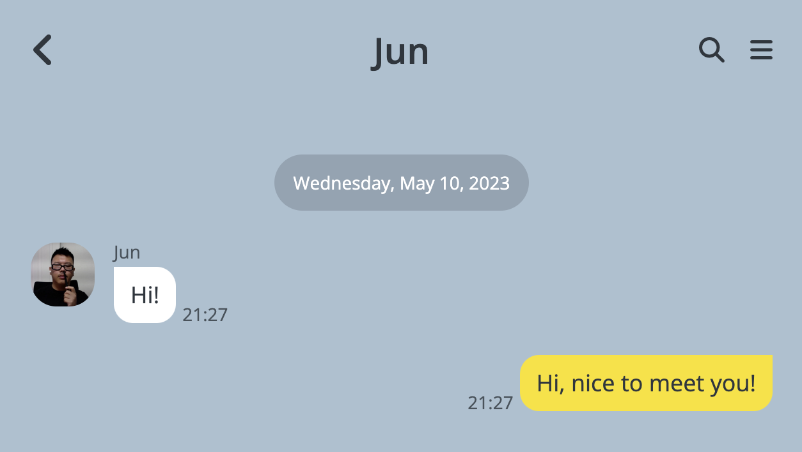

# 노마드 코더의 코코아톡 클론 코딩

## 처음 시도해 본 클론 코딩
이 클론에 대한 리드미를 적으니 감회가 새롭네요. 니콜라스 선생님의 무료 클론코딩 강의를 들으며 만들었습니다. 상자 하나, 글 하나 화면에 출력되는 것을 보며 기쁨과 희열을 느꼈던 기억이 납니다. (물론 리드미를 적는 지금의 코딩이 더 즐겁습니다. 기술의 습득과 창조력은 정확히 비례하네요!) 화면이 너무 크면 아무것도 보여주지 않는 어마어마한 반응형 웹이니, 적응형 웹이라고 해도 되겠습니다. 자바스크립트 없이 html과 CSS 기초로만 만들어진 제 클론 코딩을 보고 싶으시다면 아래 버셀 링크를 확인하세요.

링크 : kokoa-clone-2020-fra7.vercel.app
